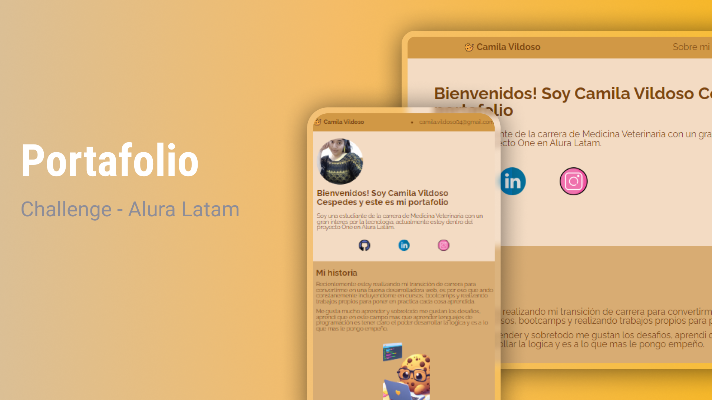

# 
 Front End - Portafolio Camila 🚀 

 Primer challenge en la especialización de Front-end de Alura latam

  <a href="#-tecnologias">Tecnologias</a>&nbsp;&nbsp;&nbsp;|&nbsp;&nbsp;&nbsp;
  <a href="#-projeto">Projeto</a>&nbsp;&nbsp;&nbsp;|&nbsp;&nbsp;&nbsp;
  <a href="#-layout">Layout</a>&nbsp;&nbsp;&nbsp;|&nbsp;&nbsp;&nbsp;

## 💻 Tecnologías 

Este proyecto fue realizado con las siguientes tecnologías:

- HTML y CSS
- JavaScript
- Git y Github
- Figma

## 📝 Proyecto
En este proyecto sirvio para demostrar quien soy y como voy avanzando en el mundo del desarrollo web, por ultimo poniendo en practica todas las habilidades adquiridas en Alura latam en su programa con Oracle.

## 🔗 Link

Pueden visualizar el proyecto através [DEL LINK](https://camilavildoso.github.io/Challenge-one-portafolio/).
